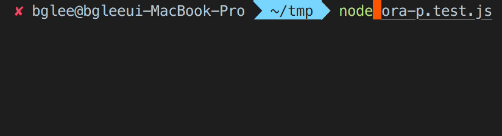

# ora-p

> Promise based currying ora function



## Install

```sh
npm install ora-p
```

## Usage

```typescript
ora('text', promise)
```

#### with currying

```typescript
import ora from 'ora-p'

// promise delay helper
const delayO = time => new Promise(r => setTimeout(r, time))
const delayX = time => new Promise((_, r) => setTimeout(r, time))

// currying
const load = ora('loading')
const search = ora('searching')

async function main() {
  await load(delayO(1000))
  await search(delayO(1000))
  await load(delayO(1000))
  await search(delayX(1000))
}
main() // screenshot
```

## License

MIT